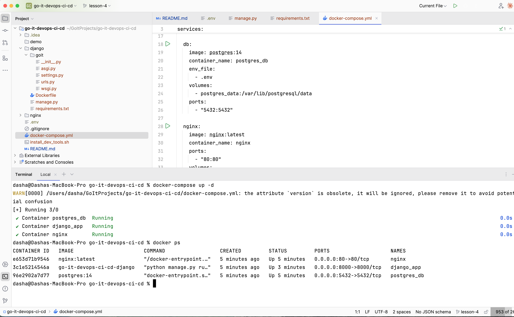

# Django + PostgreSQL + Nginx (Docker)

Docker-проєкт з Django, базою даних PostgreSQL та веб-сервером Nginx.

## Вимоги

- Docker
- Docker Compose

## Швидкий старт

### 1. Створіть .env файл
```bash
cp .env.example .env
```

### 2. Запустіть контейнери
```bash
docker-compose up -d
```

### 3. Перевірте статус контейнерів
```bash
docker ps
```

### 4. Відкрийте у браузері
- http://localhost (через Nginx)
- http://localhost:8000 (Django напряму)

### 5. Перегляд логів
```bash
docker-compose logs
```

### 6. Зупинка контейнерів
```bash
docker-compose down
```

## Демо

### Запущені контейнери


### Стартова сторінка Django

