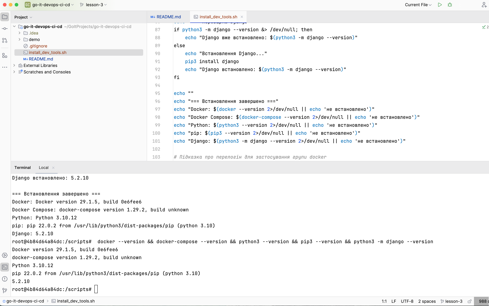

# DevOps CI/CD

## Опис

Репозиторій містить скрипт автоматизації для налаштування середовища розробки на системах Ubuntu/Debian.

## Що встановлює скрипт

- **Docker** — платформа для контейнеризації застосунків
- **Docker Compose** — інструмент для запуску багатоконтейнерних застосунків
- **Python 3** — мова програмування
- **pip** — менеджер пакетів Python
- **Django** — веб-фреймворк Python

## Особливості

- Автоматична перевірка наявності інструментів перед встановленням
- Підтримка запуску від звичайного користувача та від root
- Працює як на звичайній системі, так і в Docker-контейнері

## Запуск у Docker

1. Запустити контейнер Ubuntu з підключенням поточної директорії:
   ```bash
   docker run -it -v $(pwd):/scripts ubuntu:22.04 bash
   ```

2. Перейти до директорії зі скриптом та запустити його:
   ```bash
   cd /scripts
   ./install_dev_tools.sh
   ```

3. Для виходу з контейнера:
   ```bash
   exit
   ```

## Структура проєкту

- `install_dev_tools.sh` — основний скрипт встановлення
- `demo/` — демонстраційні матеріали

## Демо

