# DevOps CI/CD

## Lesson 5: Terraform (AWS)

Terraform-проєкт для створення AWS інфраструктури:
- **S3 + DynamoDB** — зберігання Terraform state
- **VPC** — мережева інфраструктура (публічні/приватні підмережі, NAT Gateway)
- **ECR** — репозиторій для Docker-образів

### Швидкий старт
```bash
cd lesson-5
terraform init
terraform plan
terraform apply
```

---

## Демо (Lesson 5)

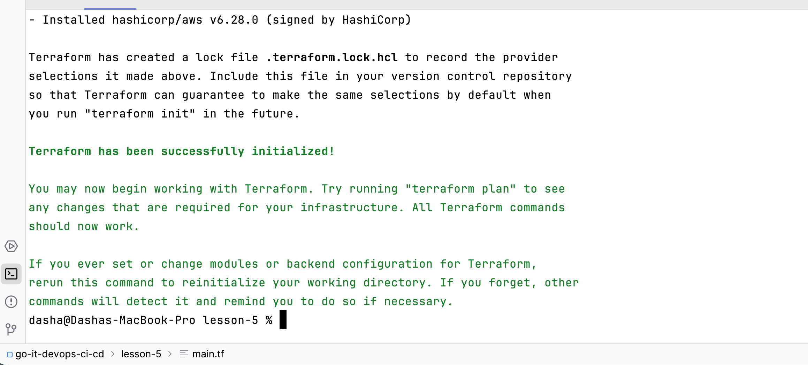
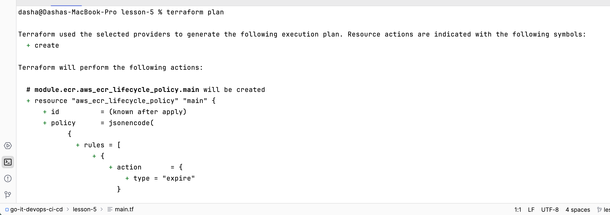
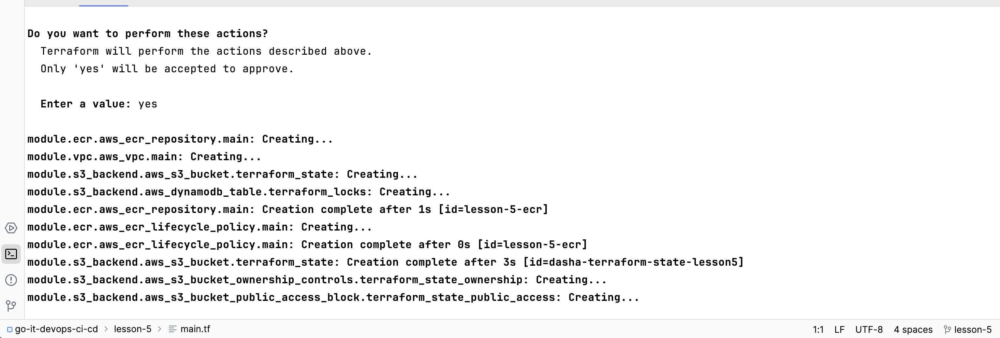
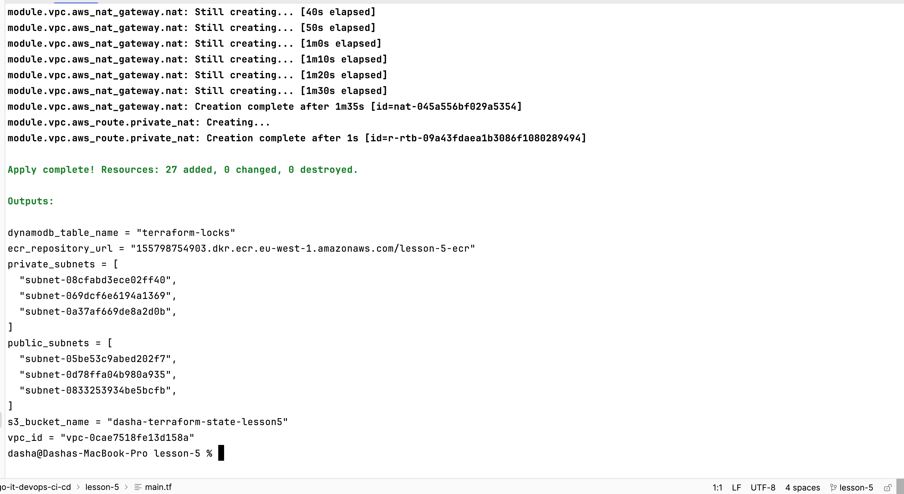
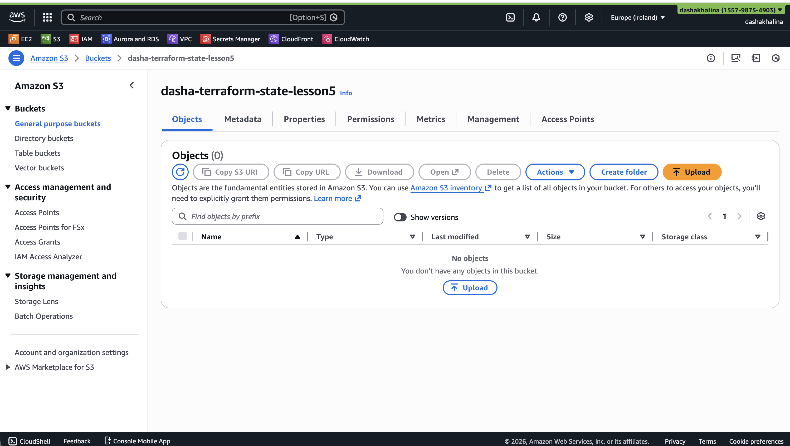
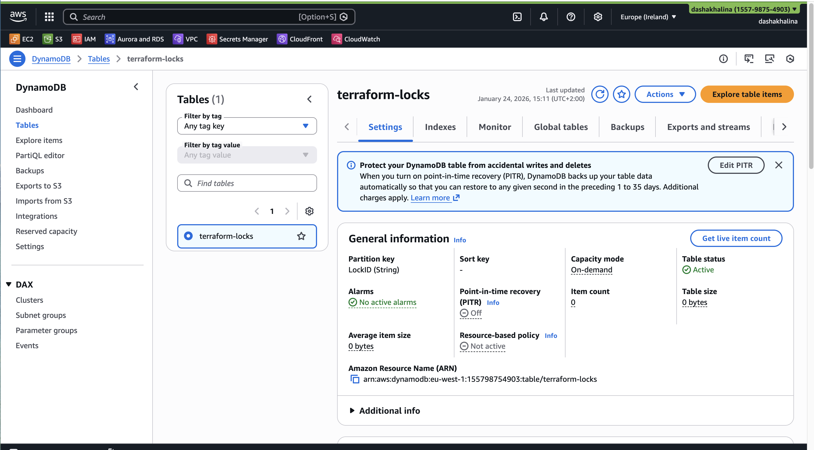
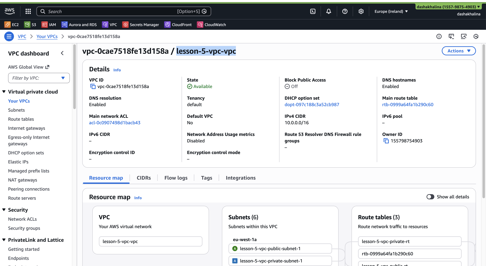
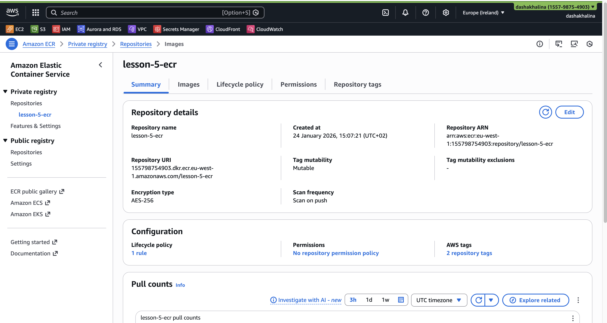
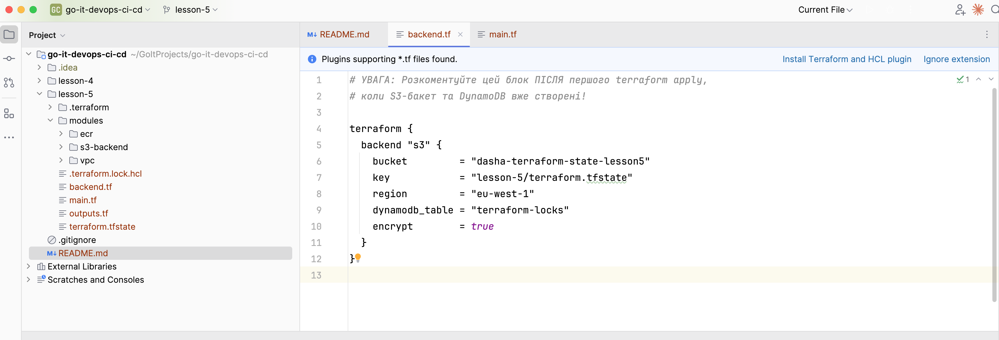
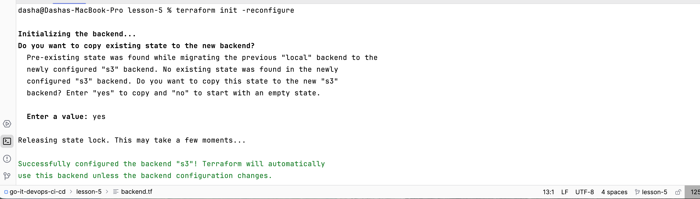
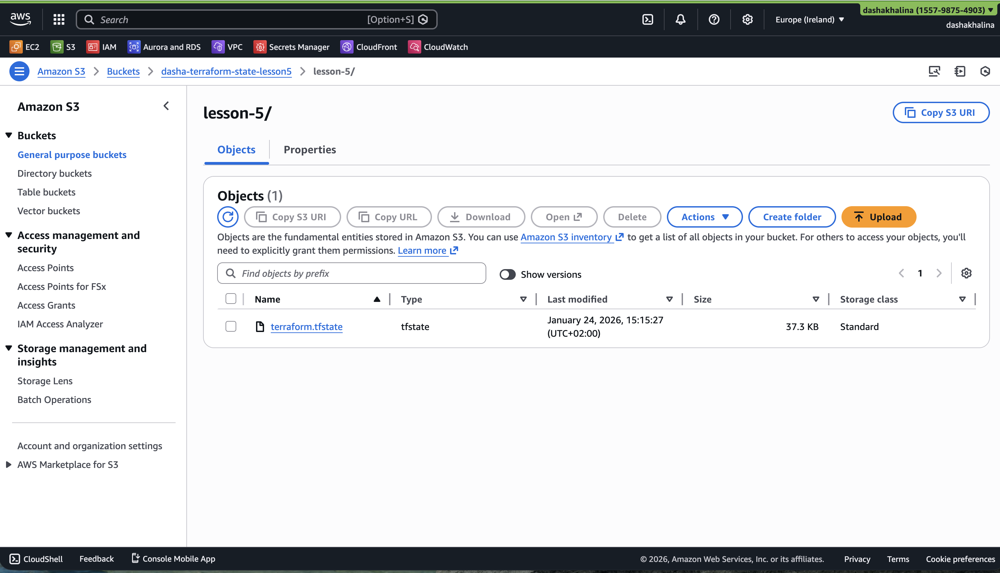
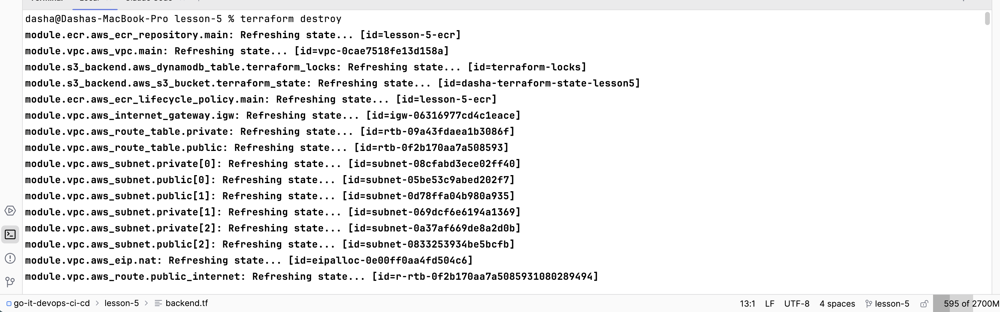
