# CI/CD Pipeline: Jenkins + ArgoCD + Terraform

## Архітектура

```
Git Push → Jenkins → Збірка Docker → Push в ECR → Оновлення Helm Chart → ArgoCD → Деплой в EKS
```

## Структура проєкту

```
├── main.tf                 # Головний конфіг Terraform
├── modules/
│   ├── vpc/                # Модуль VPC
│   ├── eks/                # EKS кластер
│   ├── ecr/                # ECR репозиторій
│   ├── jenkins/            # Jenkins через Helm
│   └── argo_cd/            # ArgoCD через Helm
├── charts/django-app/      # Helm chart для застосунку
└── docker/                 # Django застосунок + Dockerfile
```

## Розгортання інфраструктури

```bash
terraform init
terraform plan
terraform apply
aws eks update-kubeconfig --region eu-west-1 --name lesson-8-9-eks
```

## Перевірка Jenkins

```bash
kubectl get svc -n jenkins jenkins
```

Відкрити `http://<EXTERNAL-IP>` → Увійти → Натиснути `django-ci-cd` → Build Now

## Перевірка ArgoCD

```bash
kubectl get svc -n argocd argo-cd-argocd-server
kubectl -n argocd get secret argocd-initial-admin-secret -o jsonpath="{.data.password}" | base64 -d
```

Відкрити `https://<EXTERNAL-IP>` → Перевірити `django-app`: Synced, Healthy

## Доступ до застосунку

```bash
kubectl get svc -n default django-app-django
```

## Видалення ресурсів

```bash
terraform destroy
```

## Демонстрація

### GitHub Token
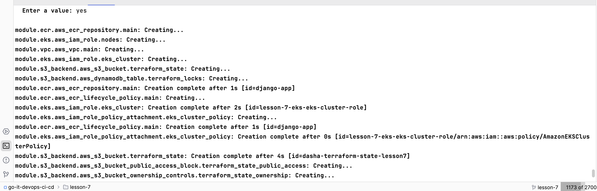

### Terraform Variables
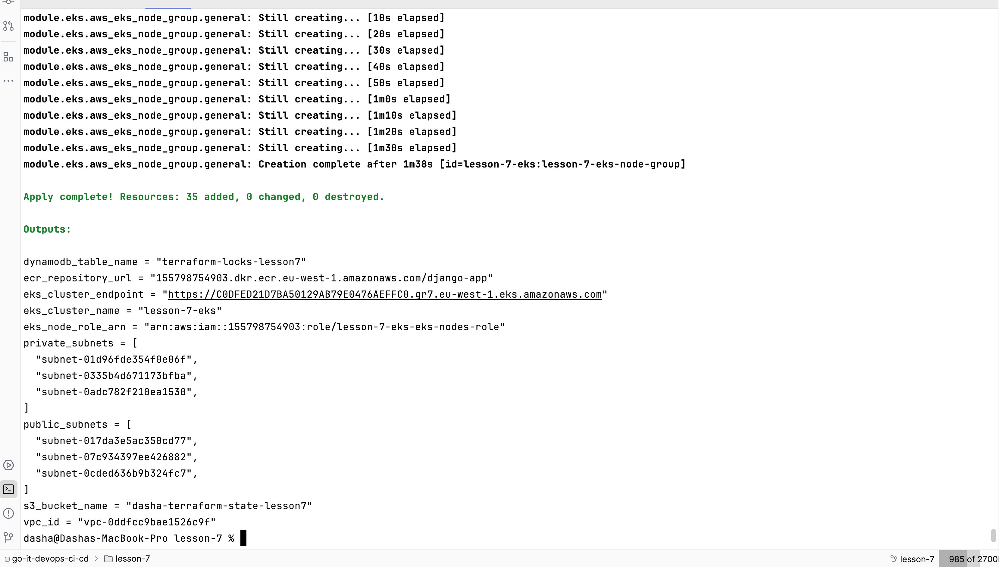

### Jenkins Pods
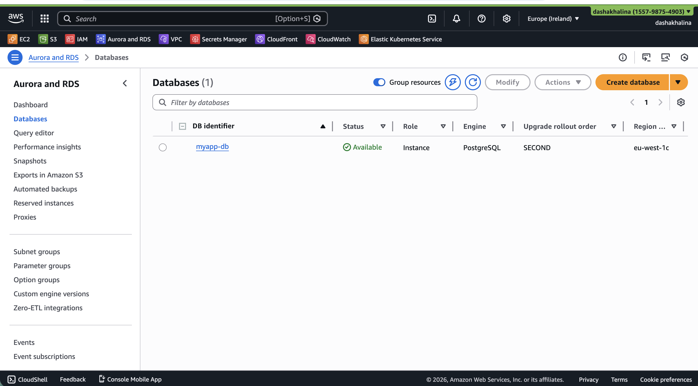

### ArgoCD Pods
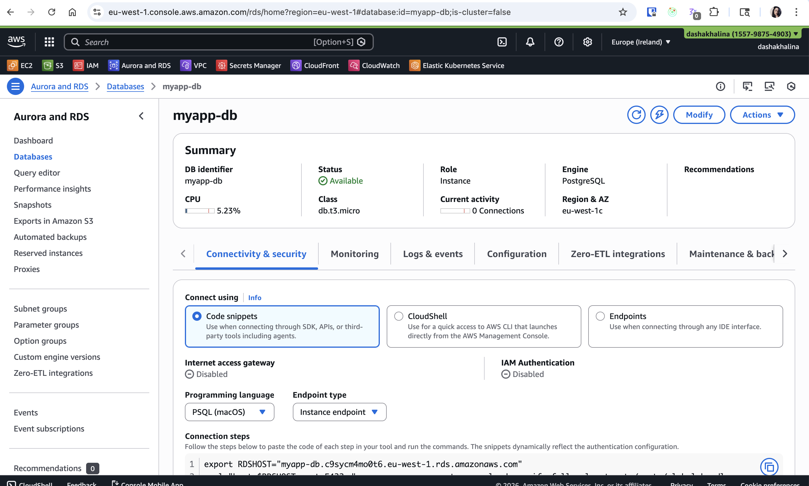

### Jenkins Service
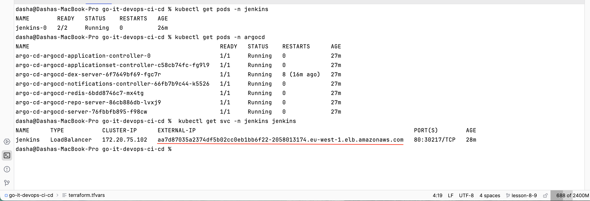

### Jenkins Login
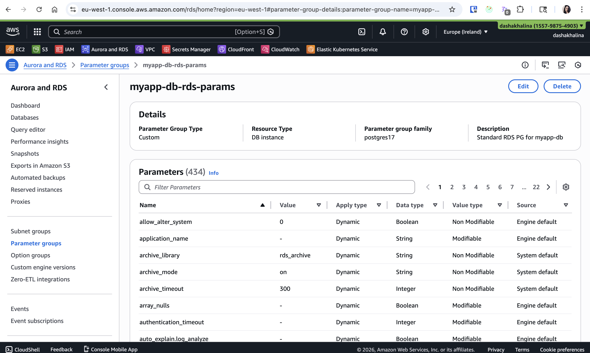

### Jenkins Dashboard
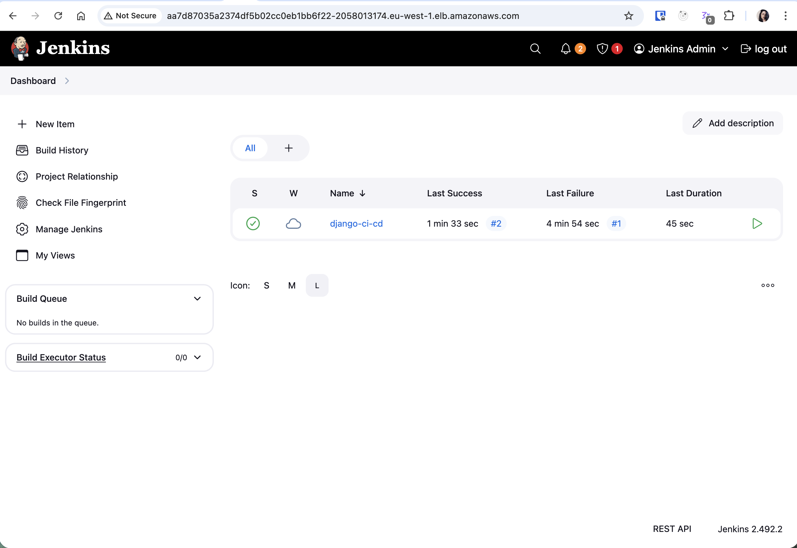

### Jenkins Build Success
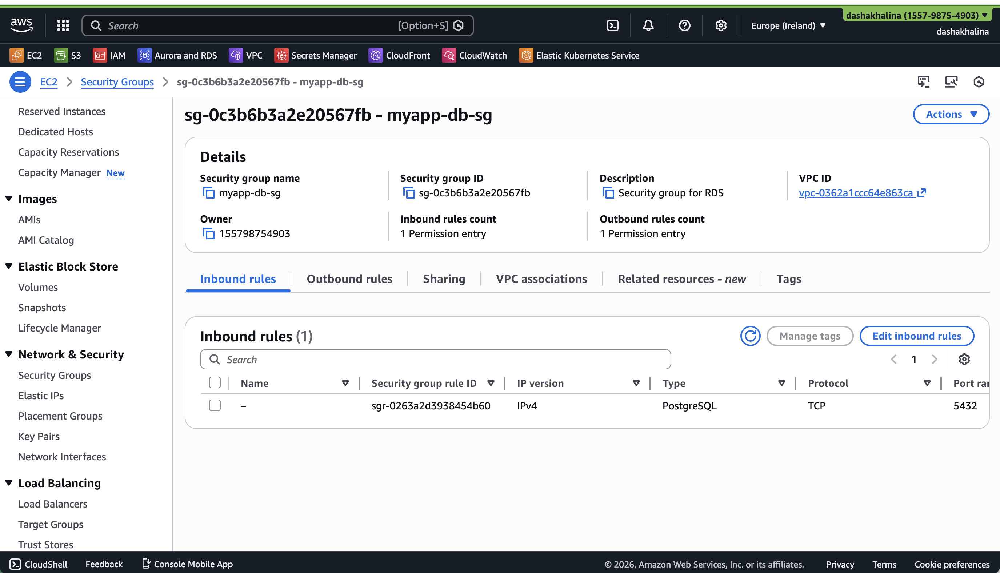

### Services Overview
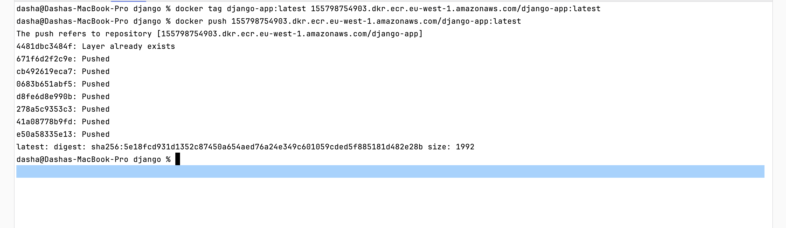

### ArgoCD Login


### ArgoCD Applications
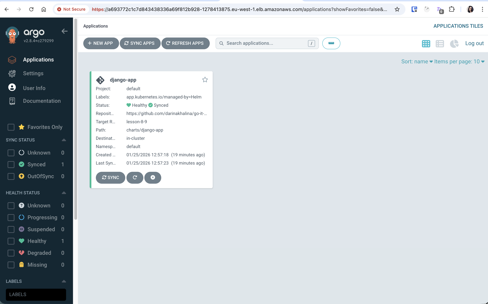

### ArgoCD App Details
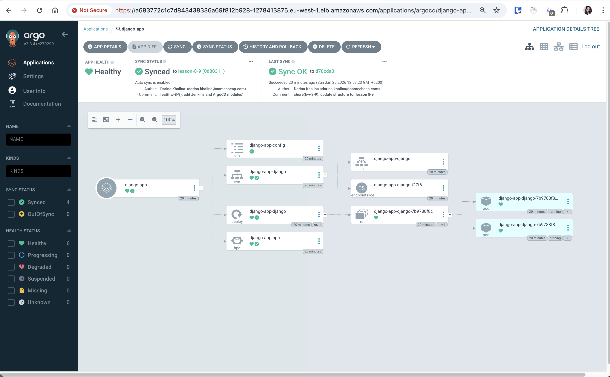

### Django Service
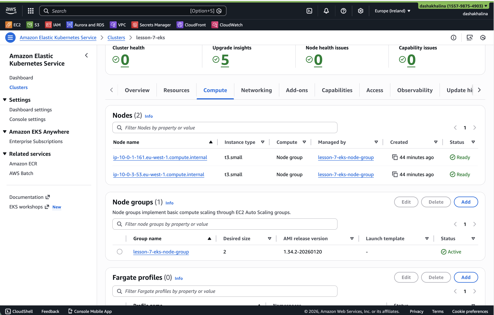

### Django App Running
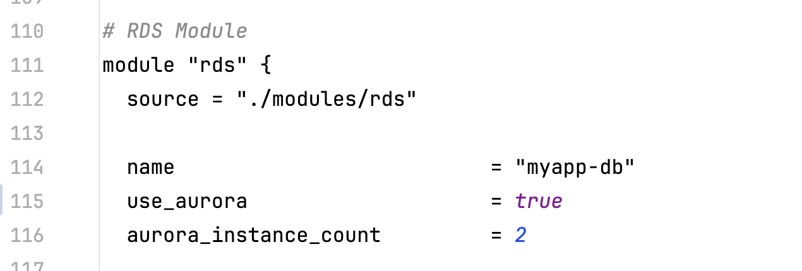

### ECR Repository
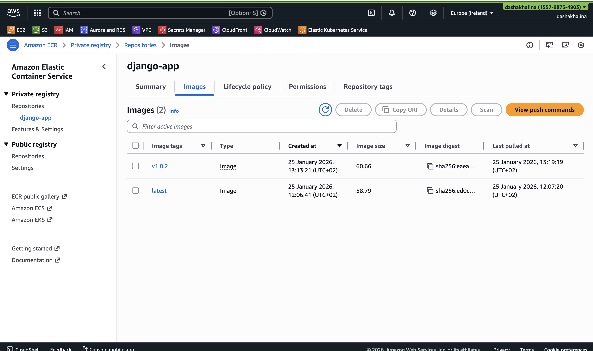

### EKS Cluster
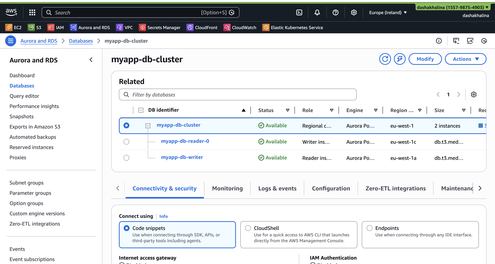

### EC2 Nodes
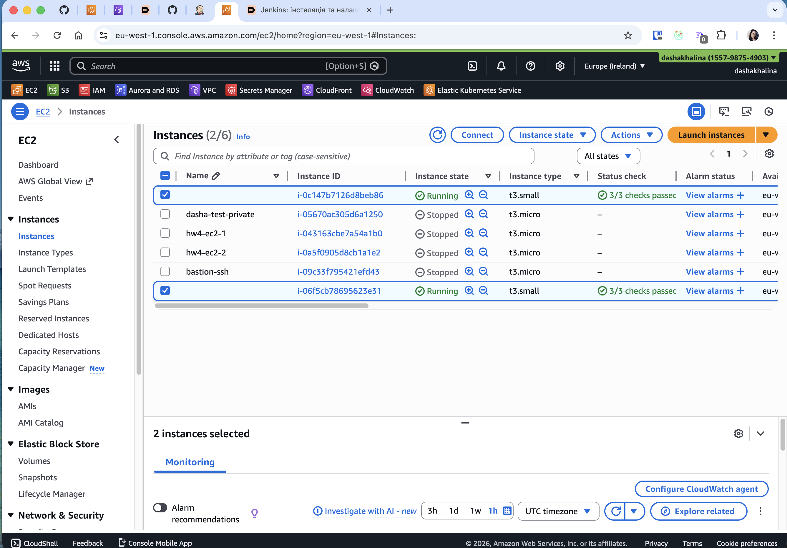

### GitHub Commits
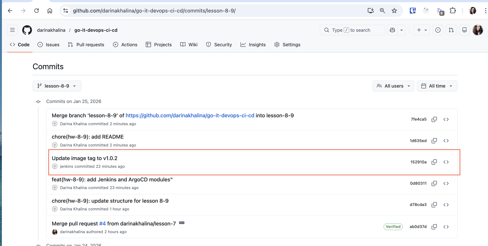

### Jenkins Blue Ocean Pipeline
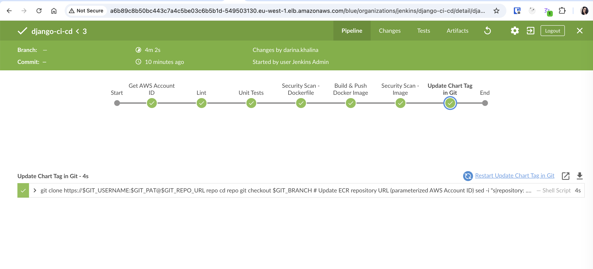

### ArgoCD Sync Status
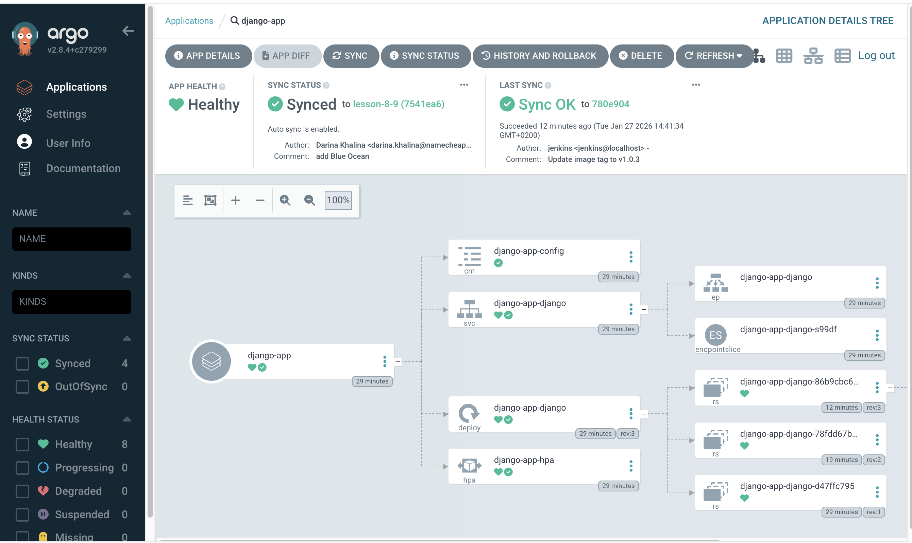